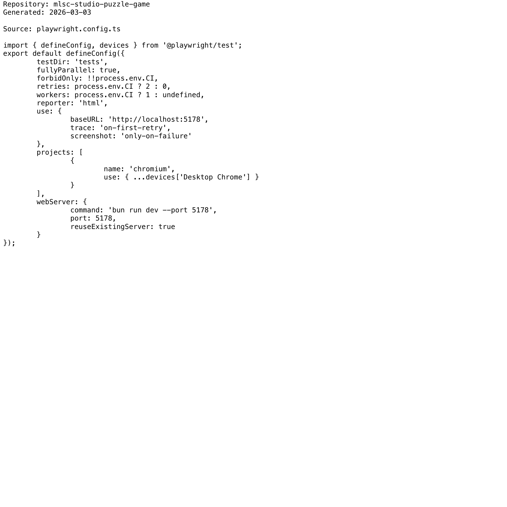

# Project Narrative & Proof

Generated: 2026-03-03

## User Journey
1. Discover the project value in the repository overview and launch instructions.
2. Run or open the build artifact for mlsc-studio-puzzle-game and interact with the primary experience.
3. Observe output/behavior through the documented flow and visual/code evidence below.
4. Reuse or extend the project by following the repository structure and stack notes.

## Design Methodology
- Iterative implementation with working increments preserved in Git history.
- Show-don't-tell documentation style: direct assets and source excerpts instead of abstract claims.
- Traceability from concept to implementation through concrete files and modules.

## Progress
- Latest commit: 0ba7b82 (2026-03-03) - docs: add professional README with badges
- Total commits: 2
- Current status: repository has baseline narrative + proof documentation and CI doc validation.

## Tech Stack
- Detected stack: Node.js, TypeScript, GitHub Actions, JavaScript, HTML/CSS

## Main Key Concepts
- Key module area: `src`
- Key module area: `static`
- Key module area: `tests`

## What I'm Bringing to the Table
- End-to-end ownership: from concept framing to implementation and quality gates.
- Engineering rigor: repeatable workflows, versioned progress, and implementation-first evidence.
- Product clarity: user-centered framing with explicit journey and value articulation.

## Show Don't Tell: Screenshots


## Show Don't Tell: Code Excerpt
Source: `playwright.config.ts`

```ts
import { defineConfig, devices } from '@playwright/test';
export default defineConfig({
testDir: 'tests',
fullyParallel: true,
forbidOnly: !!process.env.CI,
retries: process.env.CI ? 2 : 0,
workers: process.env.CI ? 1 : undefined,
reporter: 'html',
use: {
baseURL: 'http://localhost:5178',
trace: 'on-first-retry',
screenshot: 'only-on-failure'
},
projects: [
{
name: 'chromium',
use: { ...devices['Desktop Chrome'] }
}
],
webServer: {
command: 'bun run dev --port 5178',
port: 5178,
reuseExistingServer: true
}
});
```
